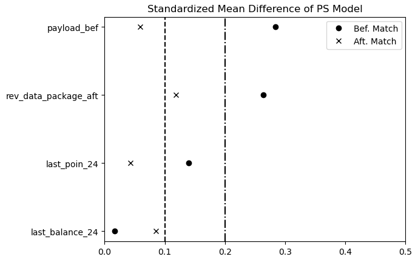

# Tsel-AAGM


# Background
Propensity score matching is a statistical technique used to estimate the effect of a treatment or intervention on an outcome of interest. It is commonly used in observational studies, where the assignment of treatment or exposure to a particular group is not randomized.

The idea behind propensity score matching is to balance the characteristics of the treatment and control groups by matching individuals with similar propensity scores, which are the probabilities of receiving the treatment or intervention based on observed covariates. This helps to control for confounding factors and reduce selection bias, allowing for a more accurate estimation of the treatment effect.

Overall, propensity score matching is a useful tool for researchers to make causal inferences in observational studies, although it is important to consider the limitations and assumptions of this method.

# Installation Guide
Will be uploaded to pypi soon,
For temporary usaga, download the matching.py from **tsel_aagm** directory, put on your project directory and import it like the code
```python
from matching import PropensityScoreMatch
```

# Requirements Library
This python requires related package more importantly python_requires='>=3.1', so that package can be install Make sure the other packages meet the requirements below
- pandas>=1.1.5,
- numpy>=1.18.5,
- scipy>=1.2.0,
- matplotlib>=3.1.0,
- statsmodels>=0.8.0

# Usage Guide
Input:
- df : dataframe with dependent variables (features), treatement column (binary value), and the outcome. No need identifier, dummy id will be generated to identify matching 
- features : features should be in list data type. Only numeric columns will be accepted (the categorial will be developed later)
- treatment : variable in string data type. The column must be in binary value, 1 for tested, 0 for control
- the outcome : variable in string data type. Only numerice will be accepted

Output:
- df_matched : Additional columns like probability score (ps) and matched_id (based on dummy_id) will be appear, to identify the matched control group
- df_TE : This dataframe contains Treatment Effect Field, consisting of actual, counterfactual, y0, y1, in y0_y1 (individual treatemnt effect)
- df_smd : Standard Mean Difference for each features before and after matching

For Analysis:
- plot_smd() : plotting the df_smd

# Example Usage
Importing libraries
```python
import pandas as pd
import matplotlib.pyplot as plt
from matching import PropensityScoreMatch
pd.set_option('mode.chained_assignment',None)
```
Initiating model
```python
# Importing Data
takers = pd.read_csv('takers_programname.csv').fillna(0)
nontakers = pd.read_csv('nontakers_programname.csv').fillna(0)
takers['label'] = 1
nontakers['label'] = 0
df_main = pd.concat([takers, nontakers], ignore_index=True)

# Defining Variable
features = ['var1','var2','var3']
treatment = 'label'
outcome = 'out1'

# Propensity Score Model
PS_model = PropensityScoreMatch(df_main, features, treatment, outcome)
PS_model.df_TE.head()
```
Output:


Evaluating Plot
```python
PS_model.plot_smd()
```
Output:


