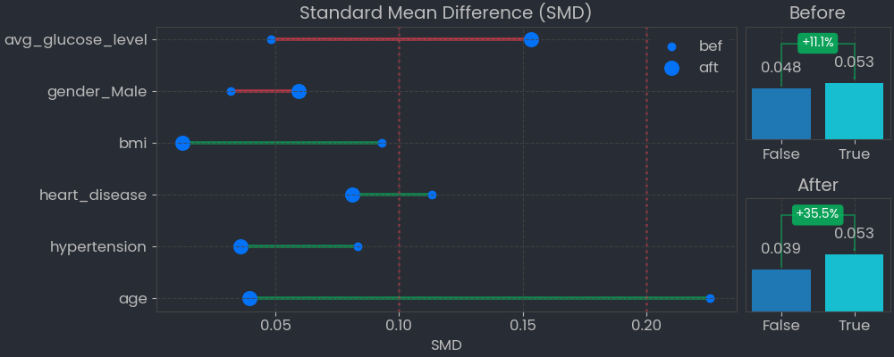

# Causal Inference using PSM


# Background
Propensity score matching is a statistical technique used to estimate the effect of a treatment or intervention on an outcome of interest. It is commonly used in observational studies, where the assignment of treatment or exposure to a particular group is not randomized.

The idea behind propensity score matching is to balance the characteristics of the treatment and control groups by matching individuals with similar propensity scores, which are the probabilities of receiving the treatment or intervention based on observed covariates. This helps to control for confounding factors and reduce selection bias, allowing for a more accurate estimation of the treatment effect.

Overall, propensity score matching is a useful tool for researchers to make causal inferences in observational studies, although it is important to consider the limitations and assumptions of this method.

# Installation Guide
This function has been uploaded to [pypi](https://pypi.org/project/causal-inference-aagm/) so you can type on your prompt as code below
```bash
pip install causal-inference-aagm
```
Then import the library
```python
from causalinference_aagm.matching import PropensityScoreMatch
```

# Requirements Library
This python requires related package more importantly python_requires='>=3.1', so that package can be install Make sure the other packages meet the requirements below
- pandas>=1.1.5,
- numpy>=1.18.5,
- scipy>=1.2.0,
- matplotlib>=3.1.0,
- statsmodels>=0.8.0

# Usage Guide
This is a Python class named PropensityScoreMatch. It is designed to perform propensity score matching, a technique used to balance the distribution of confounding variables between treatment and control groups in observational studies. The class has four input arguments:

- df: a pandas DataFrame containing the data to be analyzed.
- features: a list of column names in df that contain the variables used to calculate propensity scores.
- treatment: a string that specifies the name of the column in df that contains the treatment variable.
- outcome: a string that specifies the name of the column in df that contains the outcome variable.

The output of the class is two pandas DataFrames:

- df_matched: a DataFrame containing the data for the matched pairs of treated and control observations.
- df_TE: a DataFrame containing the treatment effect estimates for each variable in features.

In addition to these output DataFrames, the class provides two methods for visualizing the results of the analysis:

- plot_smd(): a method that generates a plot of standardized mean differences (SMDs) between the treatment and control groups for each variable in features.
- plot_individual_treatment(): a method that generates a plot of the individual treatment effects for each observation in df_matched.

For Analysis:
- plot_smd() : plotting the df_smd

# Example Usage
Importing libraries
```python
from causalinference_aagm.matching import PropensityScoreMatch as psm
import pandas as pd
import numpy as np
import matplotlib.pyplot as plt
import seaborn as sns
plt.style.use('seaborn')
```
Initiating model
```python
# Importing Data
df = pd.read_csv('datasets/healtcare_stroke_data.csv')
def one_hot_encode(df):
    """
    One-hot encodes all object data type columns of a Pandas DataFrame.
    """
    # Get the object columns
    obj_cols = df.select_dtypes(include=['object']).columns
    # One-hot encode the object columns
    df = pd.get_dummies(df, columns=obj_cols)
    return df

df = one_hot_encode(df).fillna(0)
df.head()
df_model = df[['age','hypertension','heart_disease','bmi','stroke','gender_Male','smoking_status_smokes', 'avg_glucose_level']]
df_model.head()

# Defining Variable
features = ['age','hypertension','heart_disease','bmi','gender_Male', 'avg_glucose_level']
treatment = 'smoking_status_smokes'
outcome = 'stroke'

# Matching
model = psm(df_model, features, treatment, outcome)
```
Output:


Evaluating Plot
```python
def hist_all_features(df, features, hue):
    width = 6*len(features)
    fig, axes = plt.subplots(ncols=len(features), figsize=(width, 5))
    for i in range(len(features)):
        sns.histplot(data=df, x=features[i], ax=axes[i], hue=hue)
    plt.show()
```
```python
features = ['age','hypertension','heart_disease','bmi','gender_Male','avg_glucose_level','proba']
hist_all_features(model.df, features, hue='smoking_status_smokes')
```
Output:


```python
hist_all_features(model.df_matched, features, hue='smoking_status_smokes')
```


```python
fig, axes = plt.subplots(ncols=2, figsize=(12, 5))

# Comparing Stroke Mean without Matching
stroke_by_treatment = model.df.groupby(treatment)[[outcome]].mean()
stroke_by_treatment.plot(kind='bar', ax=axes[0], title='Before Matching')

# Comparing Stroke Mean After Matching
stroke_by_treatment = model.df_matched.groupby(treatment)[[outcome]].mean()
stroke_by_treatment.plot(kind='bar', ax=axes[1], title='After Matching')
 
plt.show()
```



```python
model.plot_smd()
```


# Further Analysis
---
Rather than direct comparison between matched test variant and control, you better try use Average Treatment Effect for deeper anaylysis. Here, medium article that I recommend
[ATE Causal Inference](https://medium.com/grabngoinfo/ate-vs-cate-vs-att-vs-atc-for-causal-inference-998a577f2f8c)
